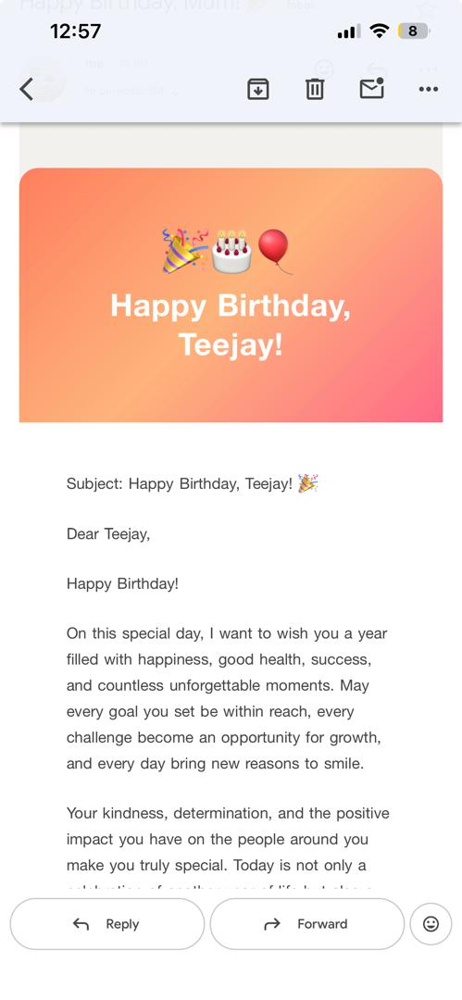

# Birthday Email Generator

This project builds a polished HTML birthday email from a plain-text template and sends it with SMTP. The result is shown below: the file `image.png` is the rendered output image from the project.

## Output

The image below is the actual project output.



## What the project does

- Reads `Data/Birthday_Wish_Template.txt` and replaces `{name}` and `[Your Name]` with real values.
- Builds a high-quality HTML birthday email using `build_html.py`.
- Sends the message through SMTP with `send.py`.

## How to run

1. Install the required dependency:

```bash
pip install python-dotenv
```

2. Add your email credentials in a `.env` file in the project root:

```text
my_email=you@example.com
my_password=your_app_password
```

3. Run the example application:

```bash
python app.py
```

## Preview without sending

If you want to see the HTML before sending, generate a preview file and open it in your browser.

```bash
python - <<'PY'
from build_html import build_birthday_email
from utils import read_file, modify
content = modify(read_file('Data/Birthday_Wish_Template.txt'), 'Teejay', 'Taofeek')
html = build_birthday_email(name='Teejay', body_text=content, sender_name='Taofeek')
open('preview.html','w', encoding='utf-8').write(html)
print('preview.html created')
PY
```

## Key files

- `app.py` — entry point that builds and sends the email.
- `build_html.py` — creates the HTML email body.
- `send.py` — sends the email via SMTP.
- `utils.py` — reads the template and applies placeholder replacement.
- `Data/Birthday_Wish_Template.txt` — source template for the birthday message.
- `image.png` — the rendered output image of the project.
